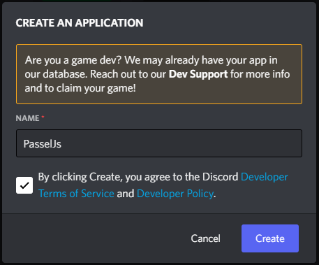
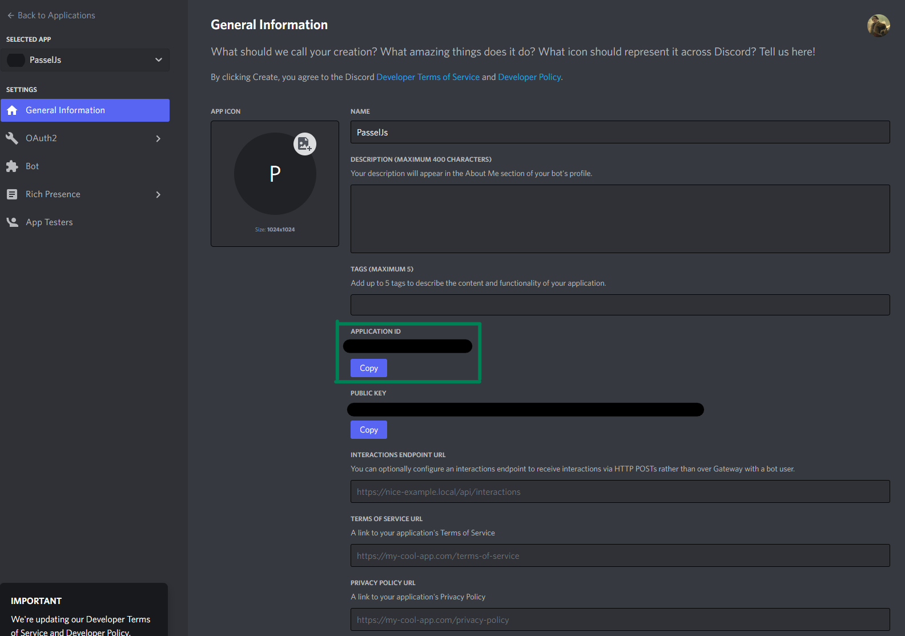
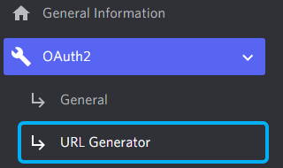
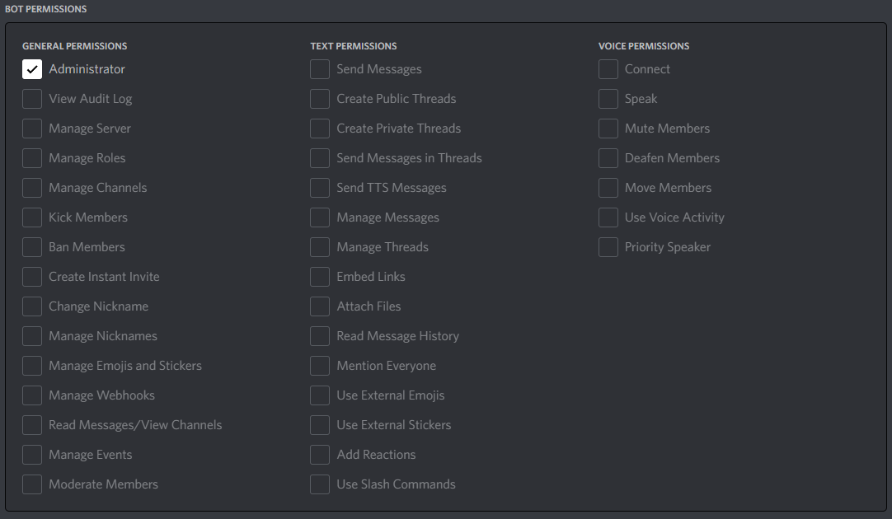
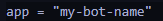
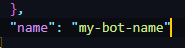

# About
This is a bot port of [Passel Public](https://github.com/stoir/passel_public) to use discords official bot api ([discord.js](https://discord.js/)). I did this mainly because I was bored and some users that wanted to host passel public wanted a discord js version. The main purpose of this bot is to serve 1 server only. If you wish to serve multiple servers, you'll need to edit the code to allow that capability.

## Contents
- [Requirements](#requirements)
- [Enable developer mode on discord](#enable-developer-mode-on-discord)
- [Create your discord bot](#create-your-discord-bot)
- [Download this repo and configure your bot](#download-this-repo-and-configure-your-bot)
- [Run your bot locally](#run-your-bot-locally)
- [Deployment](#deployment)
- [FAQ](#faq)

## Requirements
Nodejs is required to be installed on your machine before running this bot locally. Also, your choice of text editor. You will be editing files in this repo. I recommend [VSCode](https://code.visualstudio.com/) if you're just starting out.

### nodeJs For Windows/Mac:
Download and install [nodejs](https://nodejs.org/en/download/) (version >= 18.0.0)
Alternatively for Mac, you may install nodeJs via homebrew if you have it.

### nodeJs For Linux:
Follow [these instructions](https://nodejs.org/en/download/package-manager/) for your machine

## Enable developer mode on discord
Open your discord client and open your user settings.

Open the Advanced tab. On this page check Developer Mode so it's enabled. That's it you're done here.

## Create your discord bot

### Create your application
Go to the [discord dev portal](https://discord.com/developers) and sign up to become a discord developer.
In the Applications page select "New Application" on the top right.


Give your application a name. It can be anything you want, this will be the default bots name.



You will be taken to your bots page when you agree to the terms and save. Here you'll land on the General Information tab. On this
page you will want to take note of your appliaction id. Note: This page holds public Information about your bot, however this bot 
will be configured to not be public. So it is best to keep this information to yourself and not share it.



### Create and configure your bot
Select Bot on the left. On this page you'll see the Build-A-Bot page. Go ahead the select "Add Bot" and select "Yes, dot it".
You will see the option "Reset Token" below your bots name. Select that option then select "Yes, do it!". 
Enter your 2fa token if prompted.

You'll now see a string of characters (IE: `MTAxNTEwNjcwMDg0MTMyNDU5NQ.G3QeDO.i2aHpO1buLSh_RSxRkKxPFwMTvghYoKW7IjwBM`). 
Take note of this token and save it somewhere save. If you lose this token, you will need reset the token again to view 
a new token.

On the same page. Uncheck "PUBLIC BOT", Keep "REQUIRES OAUTH2 CODE GRANT" unchecked, 
and check "PRESENCE INTENT", "SERVER MEMBERS INTENT", and "MESSAGE CONTENT INTENT". Select save changes.

### Generate your bot invite
Go to OAuth2->URL Generator



On this page select scopes `bot` and `appliactions.commands`


Now select `Administrator` for Bot permissions



Copy and paste the genereated URL at the bottom in your web browser to invite your bot to your server.

This page occasionally doesn't work for some people. The link that is generated is:

`https://discord.com/api/oauth2/authorize?client_id=0&permissions=8&scope=bot%20applications.commands`

Replace the 0 after `client_id` with the Application Id on your General Information page.

## Download this repo and configure your bot
Use [this link](https://github.com/somedumbfox/passel-js/archive/refs/tags/v1.3.2.zip) to download this repo as a zip file.
Uzip the contents of the file into a folder of your choice. Copy the UNC file path to the folder.

The files you will need to edit are:
- `./src/app.js`
- `./src/deploy-commands.js`
- `./fly.toml` - optional
- `./package.json` - optional

### app.js Configuration
Find the line:
`/**---------------------------------------Start Configuration------------------------------------------------------------**/`

For each item, you'll need to set it accordingly.

- `token`: Set this variable as your discord bot token. If you're not sure, it is the alpha numeric token that looks a bit like this: `MTAxNTEwNjcwMDg0MTMyNDU5NQ.G3QeDO.i2aHpO1buLSh_RSxRkKxPFwMTvghYoKW7IjwBM` 
- `pinsChannel`: This is the Channel ID of the channel you want pins to be archived in. In discord with developer mode enabled, right click the channel you want to use and select Copy ID. Paste that ID for this variable as a string.
- `blacklistedChannels`: Using the same process for Pins Channel, paste any Channel Ids that should be black listed from archiving (IE: your mod only channels)
- `lastPinArchive`: `true/false`. True - the oldest pin is archived. False - the newest pin is archived
- `sendAll`: `true/false`. True - All pins are purged when the max pins limit is reached (50). False - Only 1 pin is archived when the max pin limit is reached.

### deploy-commands.js Configuration
Find the line:
`/**---------------------------------------Start Configuration------------------------------------------------------------**/`

For each item, you'll need to set it according.
- `clientId`: This is your appliactionId. Paste that ID within the quotes.
- `guildId`: This is your server Id. With developer mode enabled, right click your server icon, and select Copy ID. Paste that ID in the quotes for guildId.
- `token`: This is your bot token. Paste that token within the quotes.

### fly.toml and package.json configuration
This is not a required step. If you wish to keep things consistent, and want to use a different name that appears on your fly.io (see [deployment](#deployment)) account. Adjust the `name` (`package.json`) and `app` (`fly.toml`) variables in both files to the name of your choosing. Ensure both are all lowercase with no space (IE:`my-bot-name`).

`fly.toml`:



`package.json`



# Run your bot locally
It is best to run you bot on your personal machin first to ensure it is working properly after your configuration. To do so, you will want to open a terminal window (Command Prompt, Powershell, Bash, etc...) and change directory to the folder you set up earlier.

## Installation
While in the directory to the your the root of your bot folder (the file path you copied). Type:

`npm install`

## Register your bot slash commands
With the terminal still open on your root folder. Type:

`npm run register`

This command only needs to be run once after configuration. If you add more commands, or make any 
changes to the command names, you'll need to run this script again.

## Running locally
While in the root folder on your terminal. Type.

`npm start`

While the bot is running, test to see if you have configured your bot correctly with the following slash command in discord `/settings`
If you see `#channel-deleted` being listed, that means you did not copy over you channel id correctly.

Test the bot by pinning and unpinning content. If you come across an issue please let the repo owner know (@SomeDumbFox#1234). Once you finished testing locally, you may either:

- Let it continue to run. Running this bot on your machine is probably the best way to ensure it remains running at no additional cost. As long as your PC is on and connected to the internet, the bot stays online. If the bot crashes, you can restart using the `npm start` command. 
- Use a free (or paid) deployment service to keep your bot up. Keep in mind, free deployments are not reliable as there is no way of knowing how long a free service will remain free.

## Common errors
```
Error [TokenInvalid]: An invalid token was provided.
    at WebSocketManager.connect ...
    ...
  code: 'TokenInvalid'
}
```
This means the bot token you provided is invalid. If you're not sure if you copied the right value, go back the discord dev portal and reset your bot token. Also, make sure you saved your `app.js` in your text editor.

# Deployment
Fly.io offers 2 free app deployments on a shared virtual machine. If you are planning to only use this bot for pin management and nothing more, this proves to be a decent service to test out the bot. Otherwise, if you wish to add more commands and interactions with this bot, a paid service of your liking will be the best option.

Go to fly.io and click Get Started. On this page, follow the instructions on installing Fly.io to your machine, and sign up for free. Fly.io does not require a credit card to run apps 24/7, however if you upgrade to a paid service, you do get some additonal perks. Come back after you have installed fly.io and signed up. Come back here.

## Launch your nodeJS app with fly.io
On windows, you must be in PowerShell. Other systems, open your terminal and change directory to the root folder of you bot.

While in your bots root directory. Type:

`flyctl auth login` - This will open a web browser to sign in to fly.io. you may close the window when your terminal says you have successfully logged in.

Type:

`flyctl launch`

On the prompts:

`? Would you like to copy its configuration to the new app? (y/N)`
> Type `y`

`? App Name (leave blank to use an auto-generated name):`
> Choose a name (numbers/letters only, all lowercase). IE: `my-passel-bot`. You will be given a random name if left blank.

`? Select region:  [Use arrows to move, type to filter]`
> Select the region closest to you by using the up and down arrow keys. Press Enter on the region you want.

`? Would you like to set up a Postgresql database now? (y/N)`
> Type `n`. OPTONAL: If you wish to add your own commands, and wish to add a Postgresql database. then you may do so. free database usage is 500 MB in size total.

`? Would you like to deploy now? (y/N)`
> Type `y`

After that watch your terminal launch your first bot. Once it's launched, check your fly.io dashboard and see if it's running.

## Deploying changes
If you needed to update your bot with new configurations, once you have saved your files. Go ahead and open your terminal (PowerShell on Windows) and change directory to your bots root folder.

In the terminal, while in your bots root folder. Type:

`flyctl auth login` - Follow directions to login. Close browser when done.

`flyctl deploy`

Watch the app build and deploy, and check your fly.io dashboard to ensure you bot successfully restarted.

## Deleting your app
If fly.io is not to your liking. You have 2 ways to delete your app.

The first way, and easiest, is to log in your fly.io dashbaord and select the app you want to remove. Go to the settings of the app, and select "Delete app". Follow the prompt and your done.

In your terminal (PowerShell on windows), change directory to your bots root folder. Type:

`flyctl auth login` - Follow directions to login. Close browser when done.

`flyctl delete app-name --yes` - Replace `app-name` with the name of your app in the `fly.toml` file. 

## FAQ
> Can I create my own repo without forking this repo so it can be private?

Absolutely. You're also more than welcome to fork the repo if keeping it public is not an issue.

> Can I save my bot token on the repo I made?

Only if your repo is private. Even then it's not recommended to do so. Look into loading your bot token 
as a configuration file, or as an environment variable instead.

> My bot doesn't seem to work, I made a pin but discord tells me I reached my max.

You'll need to unpin your most recent pin, and repin it for it to take affect.
This bot only works when the pins list has not reached it's max yet.

> I know my last pin reached my max pins but the bot did nothing?

Ensure your bot is online. If so, check the channel id you pasted for `pinsChannel` is 
correct and not assigned as a `number`, but as a `'string'`. Also, check to make sure the 
channel in question is not listed in the `blacklistedChannels` array.
